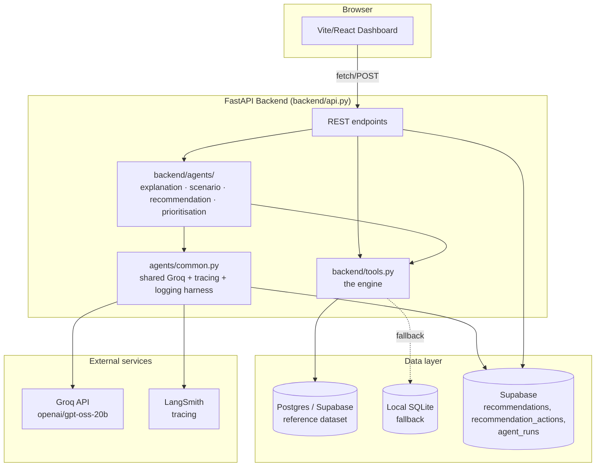
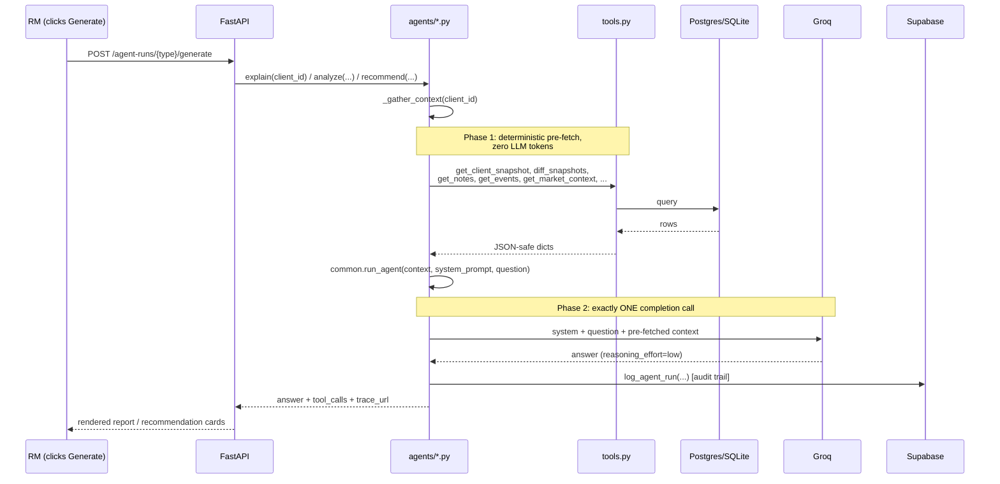
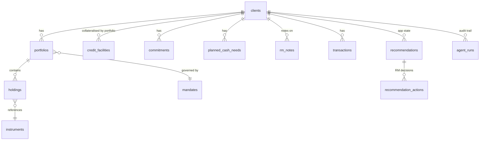

# North Bear

An AI-powered wealth advisory workbench for relationship managers, built for the
SingHacks 2026 Julius Baer "Wealth Intelligence" challenge. ("North" for
direction/guidance, "Bear" for Julius Baer.)

Moves from *"what does my client's portfolio look like?"* to *"what should I know,
and what should I do next?"* — four AI agents (Explanation, Scenario,
Recommendation, Prioritisation) grounded in a traceable, non-fabricating tool
layer, with the RM staying in control of every recommendation (accept / edit /
reject).

---

## 1. Quick start

### Prerequisites

- Docker + Docker Compose
- Node.js 18+ (for the frontend)
- A Groq API key (required — this is what runs the agents)
- Optionally: a Supabase project + Postgres connection string (falls back to
  local SQLite if not configured) and a LangSmith API key (tracing degrades
  gracefully if not configured)

### Setup

```bash
# 1. Clone and configure
git clone <this-repo>
cd SingHacks-2026-Popeyes
cp .env.example .env
# Fill in at minimum GROQ_API_KEY. Supabase/LangSmith vars are optional --
# see "Optional infrastructure" below for what happens if you skip them.

# 2. (Optional) If using Supabase Postgres for the reference dataset:
#    - Paste supabase/schema.sql into the Supabase SQL Editor and run it
#      (creates the app-state tables: recommendations, recommendation_actions, agent_runs)
#    - Seed the reference dataset:
docker compose build
docker compose run --rm backend python -m backend.seed_postgres

# 3. Start the backend API
docker compose up -d
# API now running at http://localhost:8000 (check http://localhost:8000/api/health)

# 4. Start the frontend
cd wealth-intelligence-merged-frontend/merged
npm install
npm run dev
# Dashboard now running at http://localhost:5173
```

### Verifying it's working

```bash
# Book overview, all 20 clients
curl http://localhost:8000/api/clients

# Full tool-layer sweep across all 20 clients, every tool function
docker compose run --rm backend python check_all_clients.py

# Run one agent for real against its focal client (spends real Groq tokens)
docker compose run --rm backend python run_explanation_agent.py    # CL-0012
docker compose run --rm backend python run_scenario_agent.py       # CL-0019
docker compose run --rm backend python run_recommendation_agent.py # CL-0014

# Prioritisation is book-wide, not per-client -- the ranking itself is free
# (zero Groq tokens); only the narrative briefing spends real tokens
curl http://localhost:8000/api/priorities                       # ranked book, zero-cost
curl -X POST http://localhost:8000/api/priorities/agent-run/generate # narrative briefing
```

### Optional infrastructure — what happens if you don't configure it

| Component | If configured | If not configured |
|---|---|---|
| `DATABASE_URL` (Supabase Postgres) | Reference dataset (clients, portfolios, holdings, ...) served from Postgres | Falls back automatically to an in-memory SQLite build from the raw CSVs. Logged, not silent. |
| `SUPABASE_URL` / `SUPABASE_SERVICE_ROLE_KEY` | Recommendations and the agent-run audit trail persist across restarts | These are required for the Recommendation Agent's accept/edit/reject flow to have anywhere to write — without them, `backend/supabase_client.py` calls will fail. This is the one piece that isn't optional in practice. |
| `LANGSMITH_*` | Every agent run gets a clickable trace URL | Agents still run and answer normally; `langsmith_trace_url` is just `null` |

---

## 2. The problem, in one paragraph

Julius Baer's RMs can already see valuations, performance, and allocations —
but the tools are descriptive, not advisory. A relationship manager covering
20 clients has to manually notice that a bond portfolio's loss is a *duration*
problem and not a management failure, that a structured product's "worst-of
basket" secretly doubles down on a stock the client already holds, or that a
client's redevelopment financing need arrives in a currency and time window
the portfolio can't actually cover from what's liquid. This project is the
intelligence layer that surfaces those things before the client has to ask.

---

## 3. Architecture

### 3.1 System overview



**Why this shape:**
- `tools.py` is framework-agnostic, plain Python. The dashboard's static panels
  (profile, portfolios, liquidity bar, concentration card) and all four
  agents call the *exact same functions* — one bug fix applies everywhere,
  and every number an agent cites can be traced back to a real function call
  on real data.
- The reference dataset lives in Postgres (realistic — a bank's data
  warehouse would be Postgres, not a vector store; the data is small,
  structured, and needs exact traceable retrieval, not semantic search) but
  falls back to local SQLite automatically if the connection is unreachable,
  so the core "explain this client" flow never depends on network uptime.
- Application *state* (what an agent proposed, what the RM did about it) is
  Supabase-only, deliberately separate from the read-only reference data —
  it's the part that actually needs to persist and be audited.

### 3.2 Agent execution — single-shot design

Every agent follows the same two-phase pattern, implemented once in
`agents/common.py` and reused by all four (Prioritisation's "gather" phase
is the deterministic ranking itself, described in §5 — the diagram below is
the shape all four share for the Groq call and audit logging):



This replaced an earlier LangGraph ReAct (multi-turn tool-calling) design.
The switch happened after repeated real failures: a 5-tool-call ReAct run
resent the full system prompt + tool schemas + every accumulated tool result
on **every turn** (roughly 6 compounding LLM calls for 5 tool calls), burned
~17,000 cumulative tokens in one run against this account's 8,000
tokens-per-minute cap, and would sometimes exhaust its own completion budget
mid-loop and return a completely empty answer with no error. The single-shot
design costs about one turn's worth of tokens, once, with nothing to
compound and nothing to run out of room partway through. It is also, if
anything, a more production-realistic architecture: a bank is generally more
comfortable with a predictable, tightly-scoped data-gathering step than an
LLM given free rein to decide what to query next in an open-ended loop.

`reasoning_effort="low"` matters as much as the architecture change: the
`gpt-oss` model family spends part of its completion budget on hidden
chain-of-thought separate from the visible answer, and a single large
prompt made it reason so much longer than it did per-turn in the old design
that it once burned an entire 3,000-token budget on thinking alone and
returned nothing. Forcing low reasoning effort fixed that; a follow-on fix
was adding an explicit self-check instruction to the Recommendation Agent's
prompt after it was caught reasoning backwards (correctly identifying an
equity *underweight*, then recommending trimming equity further).

### 3.3 Data model



`clients` / `portfolios` / `holdings` / `instruments` / `mandates` /
`transactions` / `credit_facilities` / `commitments` / `planned_cash_needs` /
`market_context` / `event_log` / `rm_notes` are the **reference dataset**
(read-only, from the challenge CSVs, 5 dated snapshots per row where
applicable). `recommendations` / `recommendation_actions` / `agent_runs` are
**application state** (Supabase-only, read-write, this is what makes the
system auditable — every agent run and every RM decision is a permanent
row, never overwritten).

---

## 4. The tool layer (`backend/tools.py`)

Every one of these is a plain Python function, callable directly, with zero
framework dependency. Every result carries a `sources` block (which
tables/rows it came from) and, where a value is derived rather than sourced,
a `caveats` block. Heuristic groupings are always labelled as heuristic, never
asserted as fact.

| Function | What it answers |
|---|---|
| `get_client_snapshot(client_id, as_of=None)` | What does this client's portfolio look like right now? Profile, portfolios (with mandate status embedded), holdings, facilities, commitments, cash needs, notes. |
| `diff_snapshots(client_id, from_date, to_date)` | What changed between two snapshots, and why — decomposed per instrument into price effect (the market moved) vs flow effect (a trade happened), backed by real transaction records; plus every event on record in that window. |
| `get_notes(client_id, as_of=None)` | Verbatim RM notes, oldest to newest. Never paraphrased. |
| `get_events(start_date=None, end_date=None, keyword=None)` | The authoritative 2026 event log — the only source of truth for what happened in the world, never the model's own memory. |
| `get_market_context(from_date=None, to_date=None, series_ids=None)` | Real market levels (Treasury yields, gold, Brent, FX, equity indices, VIX, CPI) with pre-computed `change` and `change_pct` — exists specifically so no agent has to guess or hand-calculate a market figure. |
| `check_mandate_breach(portfolio_id, as_of=None)` | Does this portfolio sit outside its own mandate's allocation bands or single-position limits? Custody accounts correctly return `not_applicable`, never a fabricated breach. |
| `get_facility_status(client_id, as_of=None)` | Credit facility LTV vs. its margin-call trigger, per facility — a real `breach` boolean, not a heuristic. |
| `get_liquidity_map(client_id, as_of=None, horizon_days=365)` | What's actually sellable, by tier, set against known cash needs, uncalled commitments, and credit facility headroom. |
| `get_lookthrough_exposure(client_id, as_of=None)` | Candidate concentration clusters found by matching instrument names and structured-product `underlying_reference` text — e.g. a stock, a bond, and an accumulator all referencing the same company. Requires 2+ shared meaningful words (not just 1) before linking two holdings, specifically so that generic vocabulary like "bond" or "equity" can't chain unrelated instruments together. Still explicitly labelled heuristic/candidate, not confirmed fact. |
| `list_clients(as_of=None)` | One row per client across the whole book — AUM, risk profile, quick flags (mandate breach / LTV breach / upcoming cash need) — for the book overview and the Prioritisation Agent. |
| `run_sql(sql, params)` | Read-only escape hatch (`SELECT`/`WITH` only) for anything the named tools don't cover. |

---

## 5. The four agents (`backend/agents/`)

| Agent | Scope | Capability | Output shape |
|---|---|---|---|
| **Explanation** (`explanation.py`) | Per-client (focal: CL-0012, Cheung Kwok Wing) | Attributes a portfolio's change to specific events and price/flow effects, grounded in the client's actual objectives and RM notes | One markdown report, logged to `agent_runs` |
| **Scenario** (`scenario.py`) | Per-client (focal: CL-0019, Abdullah Al-Mansoori) | Identifies which unresolved real-world situation still materially affects a client (never told the topic — has to find it), and projects escalation vs. de-escalation | One markdown report, explicitly framed as projection vs. observed fact |
| **Recommendation** (`recommendation.py`) | Per-client (focal: CL-0014, Lau Chi Ming) | Proposes 1-3 concrete, individually-actionable proposals for a human to accept/edit/reject — never bundled into one block | Parsed into discrete `{title, rationale}` items via a strict `### Recommendation: <title>` heading, each persisted as its own row in Supabase's `recommendations` table |
| **Prioritisation** (`prioritisation.py`) | Book-wide, all 20 clients | Two layers, deliberately separate: a deterministic signal/score layer (real threshold checks against mandate bands, LTV, liquidity, concentration — zero Groq tokens, runs on every page load) produces the ranking; a single-shot LLM call only narrates *why*, and cannot re-rank. This is what keeps "who does she call first" defensible rather than a black box. | Ranked list (`GET /api/priorities`, free) plus an optional narrative briefing (`POST /api/priorities/agent-run/generate`, one Groq call over the top-8 flagged clients) |

Deliberately *not* built as separate agents: concentration, mandate
governance, and liquidity all appear directly on the dashboard as
deterministic data panels (`get_lookthrough_exposure`, `check_mandate_breach`,
`get_liquidity_map`) rather than LLM output — there's no fabrication risk in
a number the code can already state directly, and building an agent around
it would be extra engineering for no extra insight. The Prioritisation
Agent's own ranking is built the same way — deterministic first — with the
LLM layered on top only for narrative, not for the decision itself.

---

## 6. Frontend (`wealth-intelligence-merged-frontend/merged/`)

Vite + React + react-router-dom, plain CSS (design tokens in `src/index.css`,
no Tailwind/component library). Two-pane layout: a persistent dark sidebar
(client list, search, sorted by client ID) on the left, the selected view on
the right.

- **Dashboard** (`/`) — the book-wide Prioritisation view. A ranked list of
  all 20 clients (priority badge, score, top signal, AUM) built entirely from
  the zero-cost deterministic ranking, plus a Generate button for the
  optional LLM triage briefing on top.
- **Client workspace** (`/client/:clientId`) — three tabs:
  - **Overview** — profile, portfolios, liquidity, concentration, RM notes,
    planned cash needs. Plain data, no AI, no Groq call.
  - **AI Insights** — Explanation / Scenario / Recommendation sub-tabs.
    Explanation/Scenario render the latest report with a Generate/Regenerate
    button (nothing auto-generates on page load, to respect the account's
    rate limits). Recommendation renders discrete cards, each with its own
    Accept / Edit / Reject buttons calling `POST /api/recommendations/{id}/actions`
    — decided recommendations lose their action buttons in the UI (no "undo"
    surfaced), though nothing currently stops another action being recorded
    via a direct API call; the lock is UI-enforced, not backend-enforced.
  - **Analytics** — four charts (recharts): asset allocation, AUM trend
    across the five real snapshot dates, actual-vs-mandate-target per
    portfolio, and concentration exposure — all sourced from the same
    tool-layer data the Overview tab shows as plain numbers, just visualized.

---

## 7. Known limitations / honest caveats

- This account's Groq tier caps at 8,000 tokens/minute and ~200,000
  tokens/day per model — the single-shot design and curated market-series
  list exist specifically to fit inside that, with real safety margin, not
  as a permanent design ideal.
- `get_lookthrough_exposure`'s clustering is keyword/name matching, not a
  confirmed security-master cross-reference — always presented as
  "candidate," never fact. It used to link any two holdings sharing even one
  significant word, which meant generic vocabulary ("bond", "equity",
  "credit") chained together unrelated instruments into fabricated
  "concentration themes" as large as 80%+ of a client's AUM. Fixed by
  requiring 2+ shared words and stopwording generic asset-class vocabulary,
  verified against all 20 clients — but a coincidental 2-word generic phrase
  (e.g. "energy majors") can still, rarely, bridge two unrelated funds. Worth
  spot-checking a client's concentration theme before presenting it, same as
  any heuristic result in this system.
- The price/flow decomposition in `diff_snapshots` is an approximation
  (quantity held at the earlier date, local price return applied to the
  earlier USD value), not exact — `transactions_in_window` is the
  authoritative record where precision matters.
- Recommendation quality on multi-constraint reasoning (e.g. "this asset
  class is underweight *and* has a single-position breach") needed an
  explicit self-check instruction to reliably get the direction of the
  proposed action right — worth knowing if you extend the prompt further.
